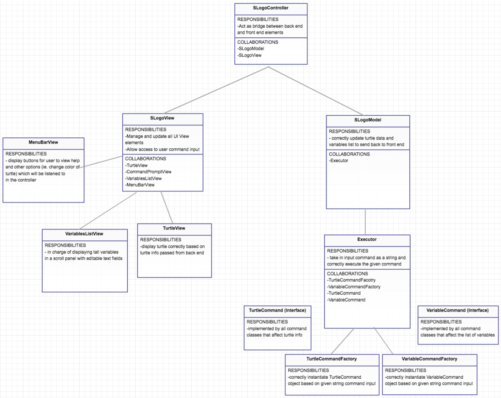
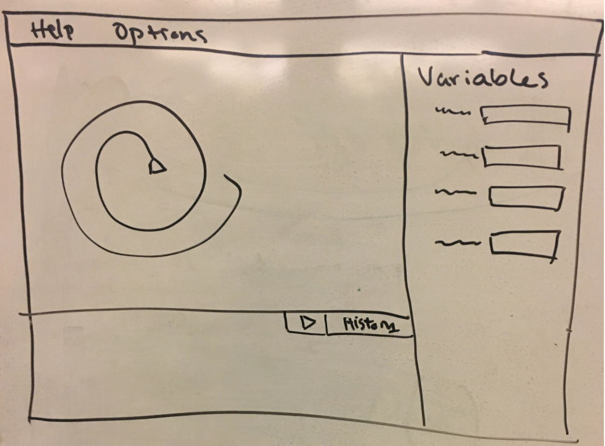

SLogo Design
============

Alex Boss (ajb112)
Hari Rajan (hpr4 )
Daniel Rubinstein ( dr148 )
Belal Taher (bt72)

Introduction
------------
For this project, our team’s goal is to write effective internal and external API’s for the frontend and backend to ensure that our project is flexible and easily extendible. The frontend will be solely responsible of taking in user input, and passing it to the backend, and displaying the turtle and all GUI elements on the window screen. The backend will be responsible for correctly parsing the user input and making the appropriate changes based on the commands. The backend will also host the command history and all the variables to ensure that there is a clear distinction between what lives in the frontend and what lives in the backend. The general structure we aim to have for this project is a fetch -> decode -> execute -> display cycle in which the frontend fetches the command(s) as a string and sends it to the backend to decode, then execute. Once the backend executes, the frontend should display all changes from the result of the command. By sorting all parts of this project into either the fetch, decode, execute, or display step, we can keep our code organized and thus, easily extendible. We are using the MVC (model, view, controller). Most of the View classes are closed. Most of the model classes are open to adding more functionality because we anticipate things like more commands and turtle behaviors in the second sprint / phase. 

Design Overview
---------------
We are following the Model-View-Controller paradigm. The following are our three main classes: SLogoModel, SLogoView, and SLogoController. SlogoController has an instance of both SlogoModel and SLogoView and will serve as the mediator between the two. The front-end will pass information to the backend using event listeners in the View, stored in the Controller. The frontend will have to pass things like the commands (Strings) entered by the user and new values for variables that are modified directly using the GUI. The backend will have to send updated turtle info and variable values to the front end using the public API. 

The four APIs are frontend internal and external, and backend internal and external. The frontend methods will be contained within SLogoView and its instance variables (View / GUI classes). The backend methods will be contained within SLogoModel (and its instance variables). The external commands will be called by the controller and the internal commands will be called by SLogoModel and SLogoView. 

User Interface
--------------
As shown in the image below, our UI will have:
area for the user to type in their Logo code at the bottom of the window
view of the turtle and its according motions that takes up a majority of the window
a list of variables on the right with editable text boxes to immediately change the variable values
a menu bar at the top of the window to change UI view elements, like the turtle color or zooming in/out on the turtle view window. 

API Details (Internal/External, Frontend/Backend)
----------------------------------------
Frontend external: methods to be called by Controller
Frontend internal: methods to be called by SLogoView

Backend external: methods to be called by Controller
Backend internal: methods to be called by SlogoModel

The rest is contained within the comments of our attached API interfaces: 
[API Interfaces](https://codeshare.io/a3AEz1)

API Example Code
--------------

Fd 50: 
Executor.parse(SlogoView.getCommandPromptViewNode().getCurrentCommand())
-> CommandFactory.getCommand(String userInput) -> Command.execute(String userInput) -> TurtleModel.update() -> variables.update() -> SlogoView.update( TurtleInfo)

XCOR:
Executor.parse(SlogoView.getCommandPromptViewNode().getCurrentCommand())
-> CommandFactory.getCommand(String userInput) -> Command.execute(String userInput) -> TurtleModel.update() -> variables.update() - > SlogoView.update(TurtleInfo)]

BK 50:
Exectuor.parse(SlogoView.getCommandPromptViewNode().getCurrentCommand())
-> CommandFactory.getCommand(String userInput) -> Command.execute(String userInput) -> TurtleModel.update() -> variables.update() - >SLogoView.update(TurtleInfo)

Clicking options:
[SLogoController]SLogoView.getMenuBarViewNode().displayOptions();

Manually input variable to variable window:
[SLogoController]SLogoView.getVariablesViewNode().createNewVariable();

-Click on ‘see a list of commands’:
[SLogoController]SLogoView.getMenuBarViewNode().displayHelpItems().buttonSelected()

-Click on a variable and change its value:
[SLogoController]SLogoView.getVariablesViewNode().updateVariable();

Design Considerations 
--------------------
We decided that the best way to have our frontend and backend interact was to include an SLogoController that contains an instance of the SLogoView and SLogoModel. If we didn’t do this, the dependencies would be through back channels (i.e. each class would have an instance variable of the other class). We decided this was inappropriate because it didn’t make sense to have two classes in the same level of the abstraction have instance variables of each other. It seemed like a more appropriate design choice to have an overarching controller that contains instances of both and allows them to communicate. Another design choice we made was to have all the error checking happen on one end of the project. Since the backend contains the “intelligence,” that’s also where the error checking occurs. Designing the frontend so that it only sends information to the backend and having all the intelligence happen at the backend is a much more compartmentalized design, so we decided to go with that. 

Team Responsibilities
-------------------
*Alex: Backend - TurtleModel, TurtleInfo, Executor, SLogoModel, Controller
*Belal: Frontend- TurtleView, MenuBarView, SLogoView
*Daniel: CommandPromptView, VariablesView, SLogoView
*Hari: Backend - TurtleCommand Interface (and subclasses), VariableCommandInterface (and subclasses), Controller, Variable

We will complete a little bit at a time and try to integrate often. We will each have our own Git branch to push to before merging to master or Dev or another branch. 

